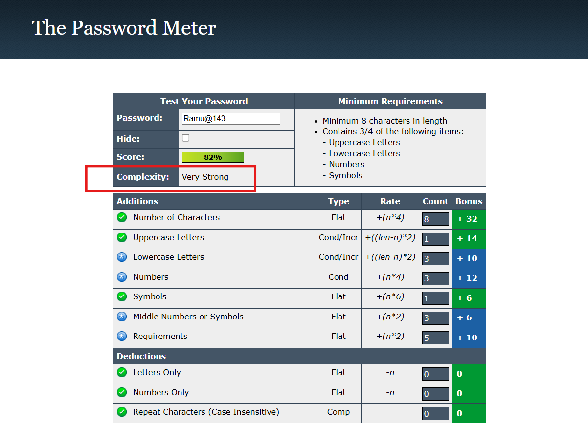
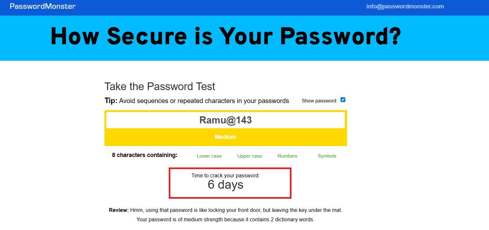
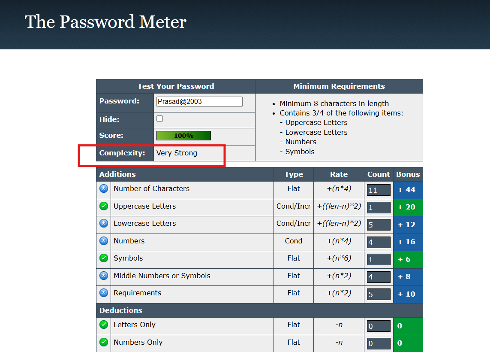
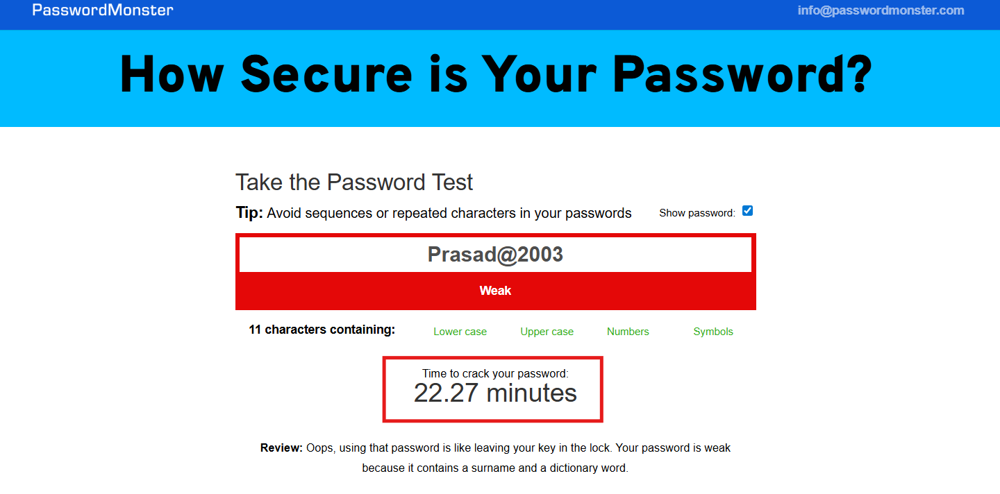
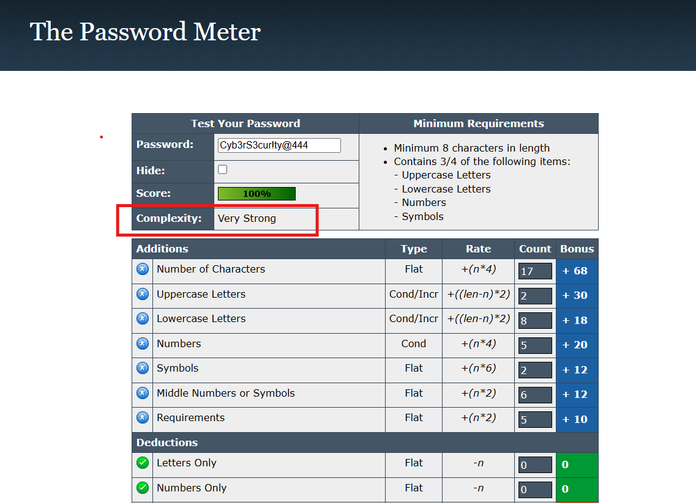
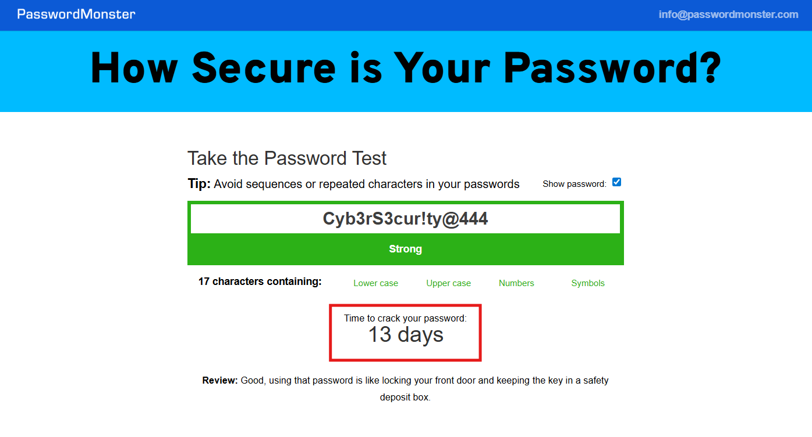
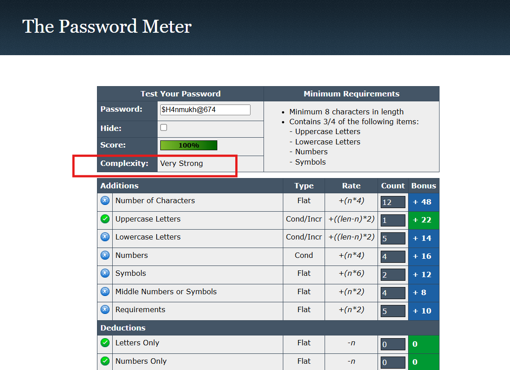
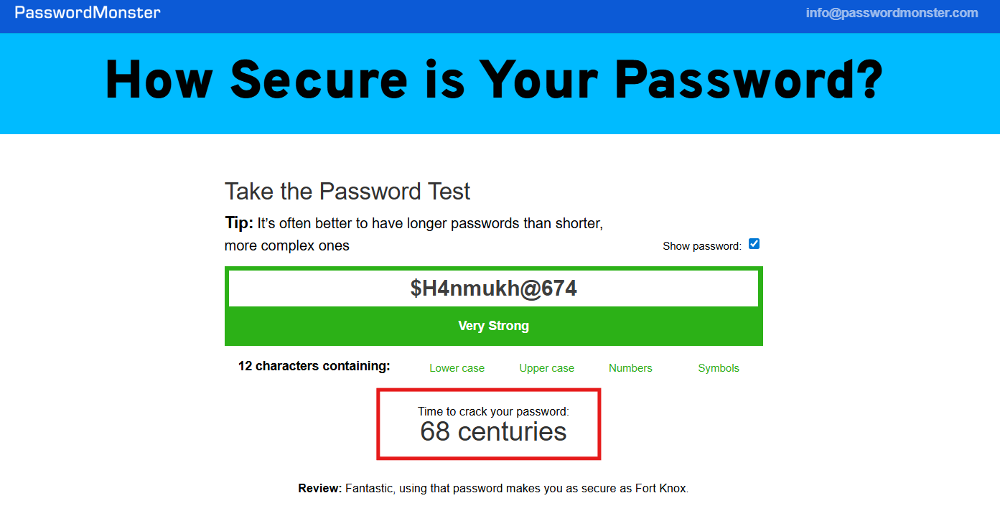

# Password Security & Strength Evaluation

## 📌 Objective
The goal of this task is to **understand what makes a password strong** and evaluate different passwords using online password strength tools.  
This helps in learning **best practices for password creation** and understanding common attacks like brute force and dictionary attacks.

## 🛠 Tools Used
- **Password Score Checker:** [passwordmeter.com](https://passwordmeter.com)
- **Password Strength Checker:** [passwordmonster.com](https://www.passwordmonster.com/)
- Any other free online password evaluation tools.

---

## 📂 Steps Performed
1. **Created multiple sample passwords** with different levels of complexity:
   - Weak → only lowercase (e.g., `password` , `Ramu`)
   - Medium → letters + numbers (e.g., `Pass1234` , `Ramu143`)
   - Strong → mix of upper, lower, numbers, symbols (e.g., `P@ssw0rd!2024` , `Ramu@2003`)
   - Passphrase → random words combined with symbols (e.g., `Blue!Tiger_Cloud#92` , `R4mu@K!ng#452`)

2. **Tested each password** using online password strength tools.  
   - Recorded scores and feedback.  
   - Saved screenshots for evidence.  

3. **Compared results** to understand how length, symbols, and randomness affect strength.

4. **Researched password attacks**:

 
 
 
 

5. **Summarized best practices** for creating secure passwords.

---

## 📊 Results
- Weak passwords scored **very low** and were flagged as easy to guess.  
- Adding numbers & uppercase improved strength but still **not safe enough**.  
- Long passphrases with mixed characters gave the **highest score**.  

**Key takeaway:** 

👉 **Length + Complexity + Unpredictability = Strong Password**

---

## ✅ Best Practices for Strong Passwords
- Use **12–16+ characters**.  
- Mix **uppercase, lowercase, numbers, and symbols**.  
- Avoid **personal info** (name, DOB, etc.).  
- Prefer **passphrases** (multiple random words).  
- Enable **Multi-Factor Authentication (MFA)**.  
- Use a **Password Manager** to generate/store passwords.  

